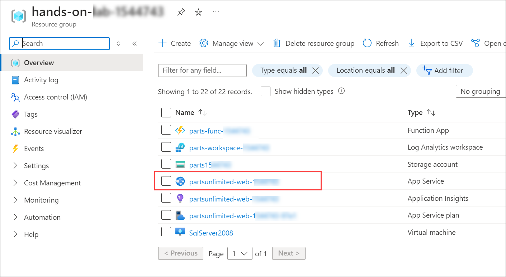
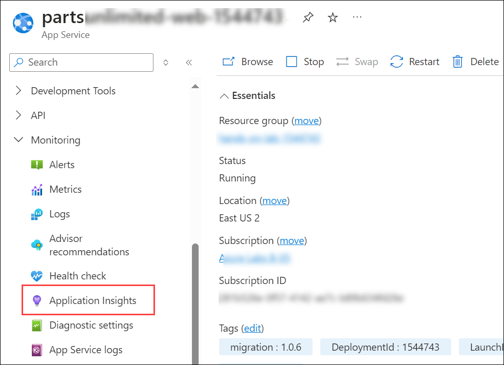
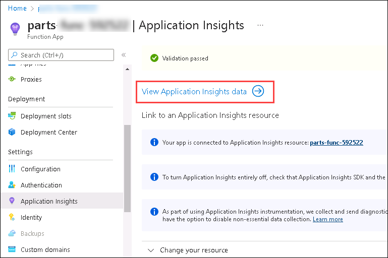
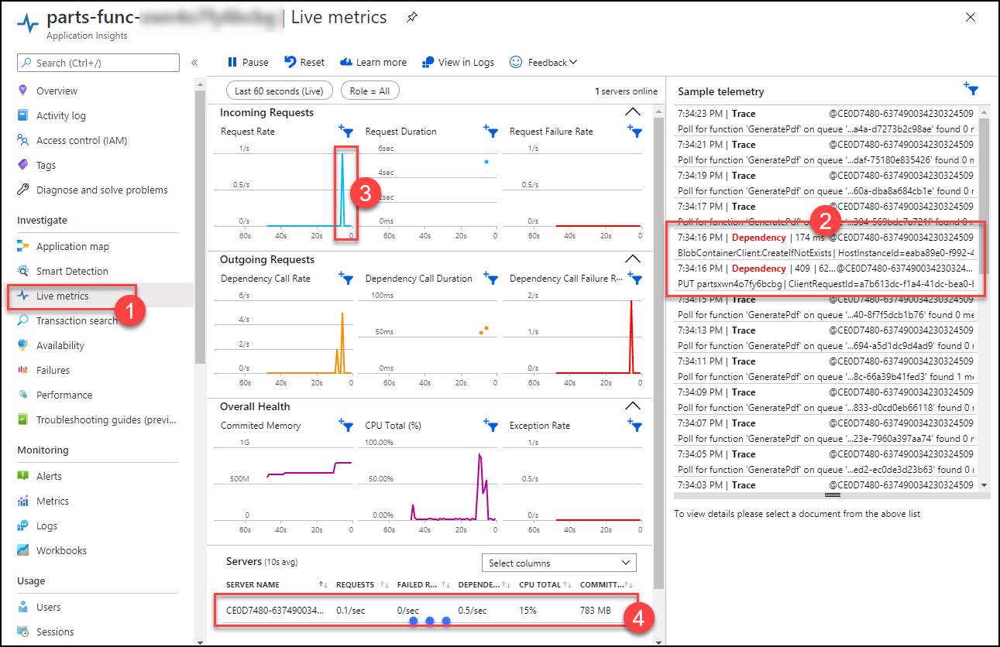

# Exercise 5: Monitoring and Maintaining

### Estimated Duration: 30 minutes

In this exercise, you will enhance the monitoring, performance, and security of the Parts Unlimited web application. You will begin by enabling Application Insights on the App Services to collect insights related to app executions. Next, you'll perform load testing on the web application using Azure Load Testing (Preview) to assess its performance under stress. Finally, you will create an Azure Key Vault to securely manage secrets and deploy the web application using a key vault secret. Additionally, you will configure a system-assigned managed identity to enable secure authentication between the Azure web app and the Azure Key Vault.

## Lab objectives

You will be able to complete the following tasks:

- Task 1: Enable Application Insights on the App Services

- Task 2: Performance testing of web app 

- Task 3: Setting up Azure Key vault

- Task 4: Create and assign system assigned managed identity

- Task 5: Securing the web app connection string with secret

### Task 1: Enable Application Insights on the App Services

In this task, you add Application Insights to your App Services in the Azure Portal, to be able to collect insights related to App executions.

1. In the [Azure portal](https://portal.azure.com), navigate to your **App Services** by selecting the **hands-on-lab-<inject key="DeploymentID" enableCopy="false"/>**
resource group, and selecting the **partsunlimited-web-<inject key="DeploymentID" enableCopy="false"/>*** App Services from the list of resources.

   

2. On the App Services App Blade, select **Application Insights (1)** under Monitoring from the left-hand menu. On the Application Insights blade, select **Turn on Application Insights (2)**.

    

3. On the Application Insights blade, provide the below information.

   - Select **Create new resource (1)**, and accept the default resource name and location provided. 
   - Select existing log analytics workspace **parts-Workspace-<inject key="DeploymentID" enableCopy="false"/>(2)** workspace from the dropdown as shown in the below screenshot.
   - Click on **Apply (3)**, and select **Yes** when prompted about restarting the App Services to apply monitoring settings.

   

4. After the  App Service restarts, select **View Application Insights data**.

    

5. On the Application Insights blade, select **Live Metrics (1)** under **Investigate**.

   

   > It might take a few minutes for the Live Metrics to get loaded. Refresh the Page to view the Live Metrics.
    
   > While monitoring Live Metrics, try submitting a new order on the Parts Unlimited website. You will see access to blob storage in the telemetry to upload the **PDF (3)**, the execution count on the **graph (2)**, and **server details (4)**.

- Task 1: Performance testing of web app (Optional)

### Task 2: Performance testing of web app (Optional)

In this task, we will see how to load test the partsunlimited web application with Azure Load Testing (Preview) from the Azure portal.

1. First, you will create an Azure Load Testing resource. In the Azure portal, click on the **Show portal menu (1)** and select **+ Create a resource (2)**.

   

2. Search for Azure Load Testing in the search box and select **Azure load testing** from the suggestions.
 
   

3. Select **Create** and click on **Azure Load Testing (1)**.

   

4. Provide the following information to configure the Load test:

   - **Subscription:** Make sure **your subscription (1)** is selected by default.
   
   - **Resource group:** Select **hands-on-lab-<inject key="DeploymentID" enableCopy="false"/>** **(2)** resource group from the drop-down
   
   - **Name:** provide **appmodloadtest<inject key="DeploymentID" enableCopy="false"/>** as the name for the load test resource **(3)**.
   
   - **Location:** **East US** **(4)**.
   
   - Click on **Review + create (5)**
 
      .png)
    
5. Post the validation passes, and click on **Create**.

    .png)

6. Click on **Go to resource** to view the resource upon successful deployment.

    .png)

7. Here, you will create a load test by using the web application URL.

8. On the **Overview** page, select **Create** for **Add HTTP request** given under _Load test your application and infrastructure_.

   

9. On the Quick test page, provide the following details:

   - **Test URL:** Enter **https://partsunlimited-web-<inject key="DeploymentID" enableCopy="false"/>.azurewebsites.net** **(1)**
   
   -  The Rest of the details are optional. Default values are already updated for all the tasks.
   
   -  Click on **Review + create (2)**. This will create and start the load test.

      

10. Once the load test begins, you will be directed to the test run dashboard. Azure Load Testing records both client-side and server-side metrics while the load test is underway. 

11. On the dashboard, you will see the client-side metrics in real-time while the test is running. The data refreshes every five seconds by default.

     

### Task 3: Setting up Azure Key vault

1. Select your **resource group** named **hands-on-lab-<inject key="DeploymentID" enableCopy="false"/>**

   

2. Select **Create** inside the resource group to add a new resource.

   
    
3. Type **Key Vault (1)** into the search box and select **Key Vault (2)** from the dropdown.

   

4. Select **Create** and click on **Key Vault** to continue.

   
    
5. On the **Basics** tab of the key vault. Provide the key Vault name as **appmod-keyvault<inject key="DeploymentID" enableCopy="false"/>** **(1)**, leave all other options as default and click on **next (2)**.

   

6. On the **Access Configuration** tab of the key vault, select the **Vault Access Policy** in Permission Model and select the **ODL_USER_<inject key="DeploymentID"/>** in Access Policies.

   

7. On the **Review + create** page, review all the options, and click on **Create**.

   
    
8. After creating the Key Vault successfully, click on **Go to resource**.

   

9. Switch to the **Secrets (1)** Blade and select **+Generate/Import (2)**.

   
   
10. On Create secret panel, enter the following details, and click on **Create**.
   
   - **Upload options**: `Manual`
   - **Name**: Enter `DB-secret`
   - **Value**: Enter SQL Connection String you copied in Exercise 4, Task 6, Step 3.

     
   
11. Once the secret is successfully created, click on the newly created secret to copy the secret identifier.

    

12. On the Secret Version panel, copy the **Secret Identifier** value and paste it into the notepad for future use.

    

   
### Task 4: Create and assign system assigned managed identity

1. Go back to the resource list and navigate to your **partsunlimited-web-<inject key="DeploymentID" enableCopy="false"/>(2)** App Service resource. You can search for **`partsunlimited-web`** **(1)**  to find your Web App and App Service Plan.

   
   
2. Switch to the **Identity** blade under settings.
   
   
   
3. On **System assigned (1)** managed identity, select **On (2)** for Status and then click on **Save (3)**. Click on **Yes** for the **Enable system assigned managed identity** pop up.

   
   
4. Once the managed identity is assigned, copy the **ObjectID** and paste it into the notepad.

   
   
5. Go back to the resource group and search for **(1)** `appmod-keyvault` to find your Key Vault and click on it **(2)**.

   
   
6. From the left navigation pane, select **Access policies (1)** and click on **Create (2)** to create the access policy for key vault.

   
 
7. Under the Permissions tab of **Create an access policy** panel, select the following:

   - **Configure from template**: Select `Secret Management` **(1)**
   - **Secret permissions**: select `Get` **(2)**
   - Click on **Next (3)**

     
   
8. Under **Principal** tab, enter the **system assigned managed identity (1)** you copied previously on step 4 and select it **(2)**. Click on **Next (3)**.

   
   
9. On the **Application (Optional)** tab, leave all the values to default and click on **Next**.

   

10. Click on **Create** under the **Review + create** tab.

    
     
11. Once the access policy creation is completed, make sure that the application access policy is listed as shown below.

    

       
### Task 5: Securing the web app connection string with secret

1. Go back to the resource list and navigate to your **partsunlimited-web-<inject key="DeploymentID" enableCopy="false"/>(2)**
App Service resource. You can search for **`partsunlimited-web`** **(1)** to find your Web App.

   

2. Switch to the **Configuration (1)** Blade and select the connection string with the name **DefaultConnectionString (2)**.

   
   
3. Edit the keyvault secret in the **@Microsoft.KeyVault(SecretUri=Secret_identifier)** format. Replace the **Secret_identifier** with the value you have copied in task 1, step 11. Copy the edited secret value that looks as mentioned below:

    `@Microsoft.KeyVault(SecretUri=https://appmod-keyvault776057.vault.azure.net/secrets/DB-secret/ffd4c9d21f8e4582956ee42b20f74e13)`
 
4. Select **Apply** when you get **Save changes** pop up click on **Confirm**.
   
5. Scroll down to the connection string details and observe that the **DefaultConnectionString** shows the **Key Vault** as the Source.
   
   
   
6. Switch to the **Overview (1)** Blade and select **Default domain (2)** to navigate to the Parts Unlimited website hosted in our Azure App Service using Azure SQL Database.

    
    
    
        
     **Note:** You may see a different image on the web app while accessing it, as there are multiple images moving on the web app page.